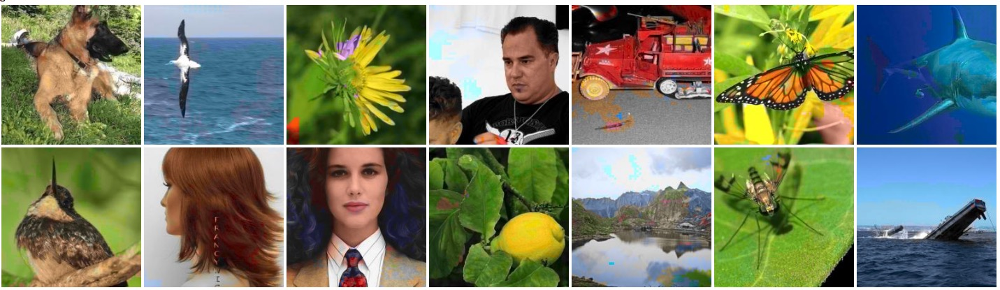

# Colorful Image Colorization
Pytorch implementation of the paper Colorful Image Colorization
https://arxiv.org/abs/1603.08511
# Results
The results of this implementation:
## good

# Prerequisites
* pytorch 0.4.0
* python 3.5
* pillow

# Getting Started
## Train
* set the datafolder to your own dataset
* python train_imagenet.py

